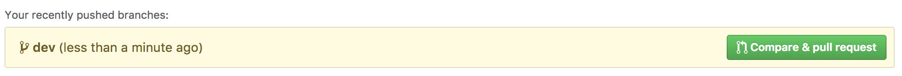
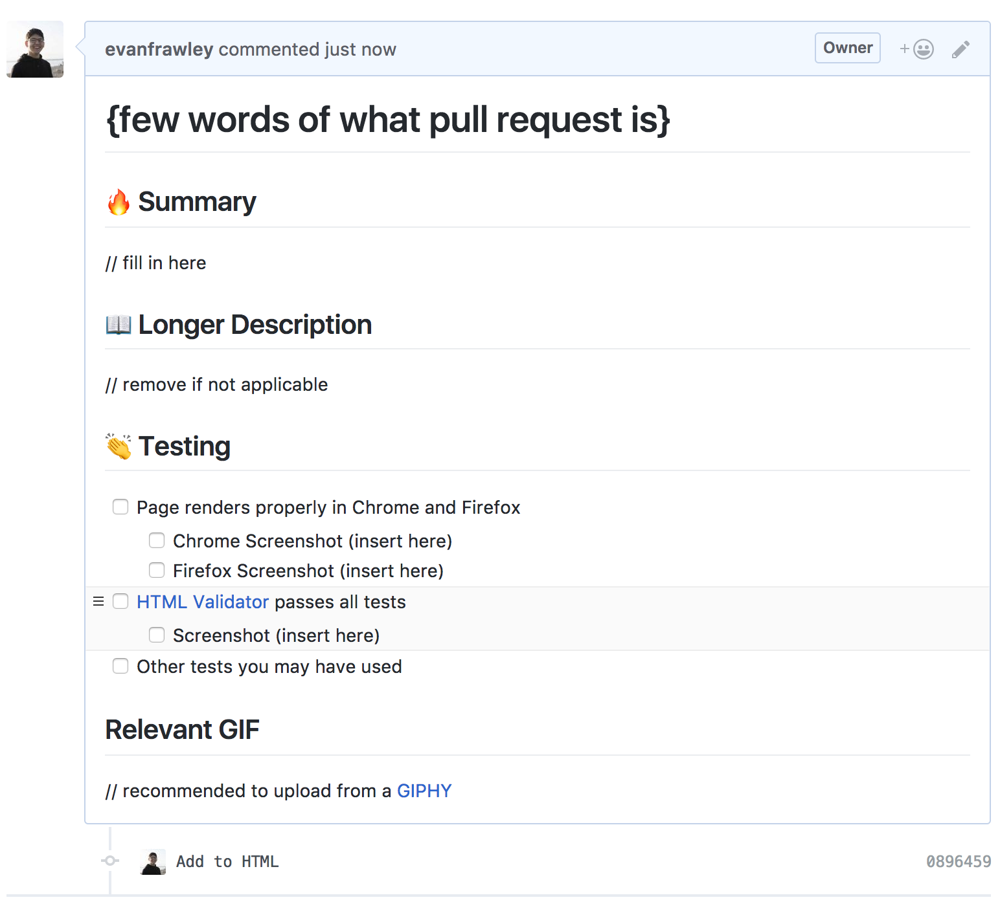

# Lab 0: Git Started :fire:

Welcome to the INFO343 lab!

Throughout this year, the labs will be unique times that Evan will teach new cool web technologies, have various academic & industry relevant exercises, and incentivize collaborative group work.

Thoughts from Evan:

> I'm gonna teach some really cool stuff that won't *explicitly* be covered in the course material, and highly recommend you actively work in lab to become a better developer and web designer!

## Jumping In!

- [ ] Finish installing all of the [necessary software](https://info343.github.io/machine-setup.html) (all 5 bullet points)
- [ ] _**Fork**_ and clone this repository
- [ ] Once cloned, create a new branch, call it something like `dev` or `development` or `lab`
- [ ] Do some coding &mdash; it doesn't have to be much, your HTML & CSS exercises are due later
  - [ ] Put something cool or interesting in the `index.html` file
  - [ ] Style your code with `styles.css` and `link` it to the `index.html`
  - [ ] Feel free to use the [`live-server`](https://www.npmjs.com/package/live-server) tool from Wednesday for testing
- [ ] Once you've finished coding, `add`, `commit`, and `push` to the new branch you just created
  > Sometimes you may get something that looks like: `git push --set-upstream origin dev` -- in which case, just copy paste that into the command line and hit enter
- [ ] After you've successfully pushed to your new branch, navigate to the forked repo on Github (eg `https://github.com/{YOUR USERNAME}/lab00-git-started`)
  - [ ] You should see a button like this (click it and make a new [Pull Request](https://help.github.com/articles/about-pull-requests/)!): 
  - [ ] The PR should pop up with some pre-defined text (not super important, but you can find it in the `.github` dir in the repo). Fill out the PR and add the necessary screenshots: 
  - [ ] Submit the PR link on Canvas (eg: `https://github.com/{YOUR USERNAME}/lab00-git-started/pull/1`)
